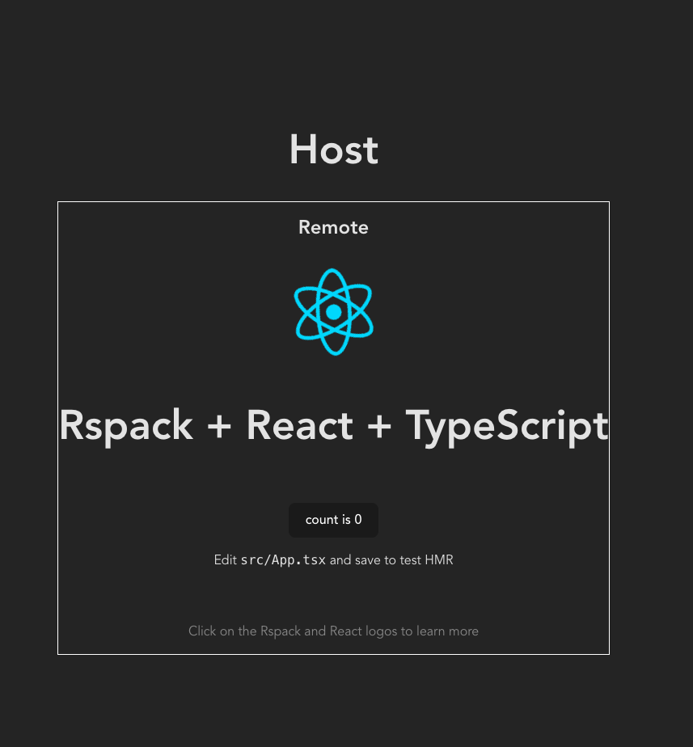

## Rspack Module Federation Enhanced (2.0)

### Running
```bash
pnpm install
```

```bash
pnpm dev
```

This will spin up two projects, a producer and consumer. This is a template file for getting module federation 2.0 running at build time with rspack. 


